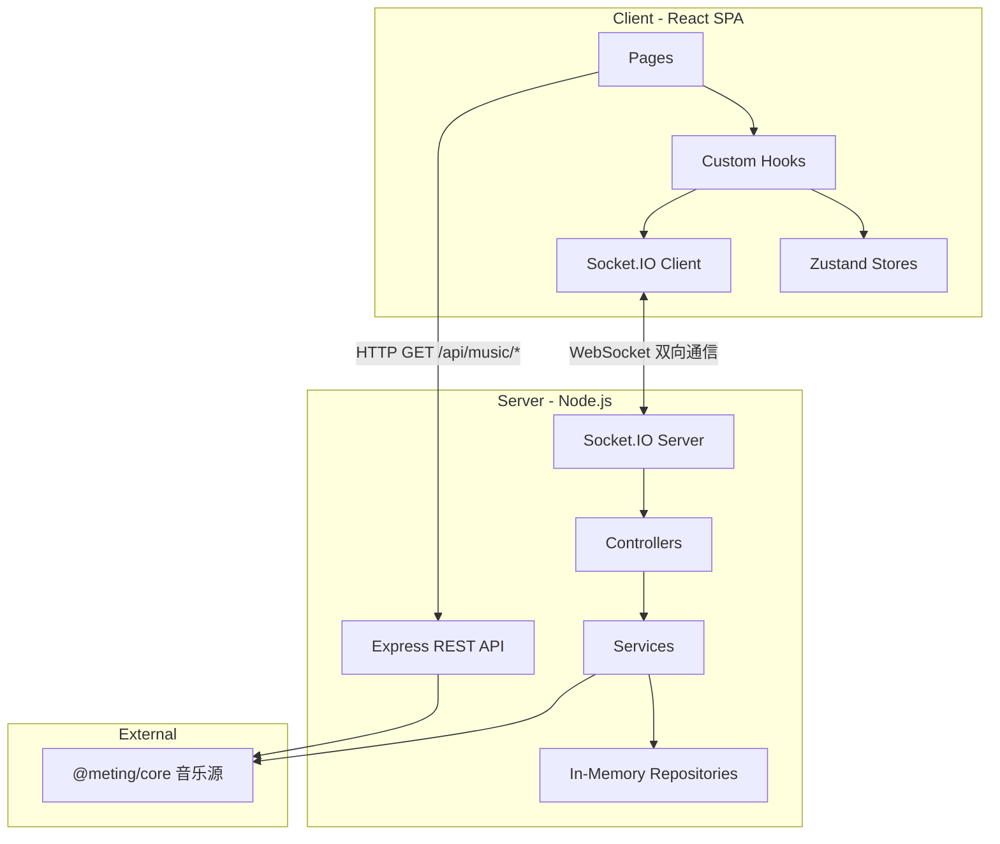

# Music Together — 项目速查手册

> 供 AI 助手快速理解项目全貌的参考文档。

## 1. 项目概览

**Music Together** 是一个在线同步听歌平台，允许多人在同一房间内实时同步播放音乐、聊天互动。

### 核心功能

| 功能       | 说明                                                                                                                                 |
| ---------- | ------------------------------------------------------------------------------------------------------------------------------------ |
| 房间系统   | 创建/加入房间，房间号邀请，可选密码保护                                                                                              |
| 多音源搜索 | 网易云、QQ音乐、酷狗                                                                                                                 |
| 同步播放   | 房间内播放进度实时同步                                                                                                               |
| 实时聊天   | 房间内文字聊天                                                                                                                       |
| 权限控制   | RBAC 三级权限（host > admin > member）基于 @casl/ability，支持 creatorId 房主回收                                                    |
| 播放模式   | 顺序播放、列表循环、单曲循环、随机播放（Host/Admin 直接切换，Member 投票切换）                                                       |
| 投票系统   | 普通成员通过投票控制播放（暂停/恢复/切歌/切换播放模式/指定播放/移除歌曲）                                                            |
| VIP 认证   | 平台账号登录（网易云/QQ/酷狗），房间级 Cookie 池（VIP 播放共享）+ 用户级歌单（私有）                                                 |
| 歌词展示   | Apple Music 风格歌词动画 (AMLL)，四级优先级：TTML 在线逐词（网易云/QQ，可配置）> 平台原生逐词（网易云 YRC / 酷狗 KRC）> LRC 行级歌词 |

### 技术栈

- **前端**: React 19 + Vite 7 + TypeScript 5.9 + Tailwind CSS v4 + shadcn/ui + Zustand
- **后端**: Node.js + Express 4 + Socket.IO 4 + @meting/core
- **Monorepo**: pnpm workspaces（3 个包：`client`、`server`、`shared`）

---

## 2. 目录结构

### 根目录

```
music-together/
├── packages/
│   ├── client/          # React 前端
│   ├── server/          # Node.js 后端
│   └── shared/          # 共享类型与常量
├── docs/                # 项目文档（含本文件 PROJECT_ARCHITECTURE.md）
├── package.json         # 根 package（工作区编排）
├── pnpm-workspace.yaml  # pnpm 工作区定义
├── pnpm-lock.yaml
├── README.md
└── .gitignore
```

### packages/client/src/ — 前端源码

```
src/
├── main.tsx                    # 入口：ReactDOM.createRoot
├── App.tsx                     # 根组件：Router + Provider + ErrorBoundary + Suspense 懒加载
├── index.css                   # 全局样式：Tailwind + 配色变量 + 自定义动画
│
├── pages/                      # 页面级组件
│   ├── HomePage.tsx            #   大厅：创建/加入房间、房间列表
│   ├── RoomPage.tsx            #   房间：播放器 + 聊天（桌面侧栏/移动端 Drawer） + 覆盖层弹窗
│   └── NotFoundPage.tsx        #   404 页面
│
├── components/                 # UI 组件
│   ├── Chat/
│   │   ├── ChatMessage.tsx     #     单条消息（用户/系统）
│   │   └── ChatPanel.tsx       #     聊天面板（消息列表 + 输入框）
│   ├── Lobby/
│   │   ├── CreateRoomDialog.tsx #    创建房间弹窗
│   │   ├── NicknameDialog.tsx  #     设置昵称弹窗
│   │   ├── PasswordDialog.tsx  #     输入房间密码弹窗
│   │   ├── RoomCard.tsx        #     房间列表卡片
│   │   ├── UserPopover.tsx     #     用户信息气泡
│   │   ├── HeroSection.tsx     #     首页 Hero 标题区域
│   │   ├── ActionCards.tsx     #     创建/加入房间卡片
│   │   └── RoomListSection.tsx #     活跃房间列表区域
│   ├── TrackListItem.tsx        #   共享曲目行渲染（序号+封面+标题VIP+歌手可点击+时长+isAdded 添加按钮，memo 优化）
│   ├── VirtualTrackList.tsx     #   共享虚拟滚动曲目列表（@tanstack/react-virtual + 无限加载 + skeleton + 空态，forwardRef 暴露 scrollToTop）
│   ├── Overlays/
│   │   ├── QueueDrawer.tsx     #     播放队列抽屉（vaul Drawer，移动端底部/桌面端右侧）
│   │   ├── SearchDialog.tsx    #     音乐搜索弹窗（VirtualTrackList 虚拟滚动 + 自动无限加载 + AbortController 竞态防护）
│   │   ├── SettingsDialog.tsx  #     设置弹窗（壳，Tab 导航：房间/成员/账号/个人/外观，移动端 nav scrollbar-hide）
│   │   └── Settings/
│   │       ├── SettingRow.tsx              # 设置行共享组件
│   │       ├── RoomSettingsSection.tsx     # 房间设置（名称、密码）
│   │       ├── MembersSection.tsx          # 成员列表（角色管理）
│   │       ├── PlatformAuthSection.tsx     # 平台账号认证（VIP Cookie，旧版，已被 PlatformHub 替代）
│   │       ├── PlatformHub.tsx            # 平台中心（登录 + 歌单浏览 + 导入，替代 PlatformAuthSection）
│   │       ├── LoginSection.tsx           # 精简版平台登录区域（PlatformHub 子组件）
│   │       ├── PlaylistSection.tsx        # 歌单列表 + 手动输入（PlatformHub 子组件）
│   │       ├── PlaylistDetail.tsx         # 歌单详情（header + VirtualTrackList + queueKeys/addedIds 去重 + 动态全部添加过滤重复）
│   │       ├── ProfileSettingsSection.tsx  # 个人设置（昵称）
│   │       ├── AppearanceSection.tsx       # 外观设置（歌词 + 背景 + 布局）
│   │       ├── OtherSettingsSection.tsx    # 其他设置
│   │       ├── ManualCookieDialog.tsx      # 手动输入 Cookie 弹窗
│   │       └── QrLoginDialog.tsx           # 通用 QR 扫码登录弹窗（网易云 + 酷狗 + QQ 音乐）
│   ├── Player/
│   │   ├── constants.ts        #     共享动画常量（SPRING / LAYOUT_TRANSITION），NowPlaying 和 SongInfoBar 统一导入
│   │   ├── AudioPlayer.tsx     #     主播放器布局（桌面：左右分栏；移动：双模式封面/歌词切换）
│   │   ├── LyricDisplay.tsx    #     AMLL 歌词渲染（LRC 正则支持 [mm:ss] / [mm:ss.x] / [mm:ss.xx] / [mm:ss.xxx]）
│   │   ├── NowPlaying.tsx      #     当前曲目展示（支持 compact 小封面横排模式 + layoutId 共享动画）
│   │   ├── SongInfoBar.tsx     #     歌曲信息栏（标题/艺术家 + 音量/聊天按钮，竖屏模式自适应缩放）
│   │   └── PlayerControls.tsx  #     进度条+播放控制+播放模式切换
│   ├── Room/
│   │   └── RoomHeader.tsx      #     房间头部（房间名/人数/连接状态；移动端 DropdownMenu 收纳设置/离开等操作）
│   ├── Vote/
│   │   └── VoteBanner.tsx      #     投票横幅（进行中的投票显示 + 投票按钮）
│   ├── InteractionGate.tsx     #   浏览器交互解锁（点击后才能播放音频）
│   └── ui/                     #   shadcn/ui 基础组件
│       ├── avatar.tsx
│       ├── badge.tsx
│       ├── button.tsx
│       ├── card.tsx
│       ├── dialog.tsx
│       ├── drawer.tsx
│       ├── dropdown-menu.tsx
│       ├── input.tsx
│       ├── label.tsx
│       ├── popover.tsx
│       ├── resize-handle.tsx
│       ├── scroll-area.tsx
│       ├── select.tsx
│       ├── separator.tsx
│       ├── marquee-text.tsx
│       ├── responsive-dialog.tsx
│       ├── sheet.tsx
│       ├── skeleton.tsx
│       ├── slider.tsx
│       ├── switch.tsx
│       ├── tabs.tsx
│       └── tooltip.tsx
│
├── hooks/                      # 自定义 Hooks
│   ├── useSocketEvent.ts       #   通用 Socket 事件订阅工具 Hook（自动 on/off，ref 稳定）
│   ├── usePlayer.ts            #   播放器主 hook（组合 useHowl + useLyric + usePlayerSync）
│   ├── useHowl.ts              #   Howler.js 音频实例管理
│   ├── useLyric.ts             #   歌词加载（TTML → 平台逐词 YRC/KRC → LRC）
│   ├── usePlayerSync.ts        #   播放同步（Scheduled Execution + Host 上报 + 周期性漂移校正）
│   ├── useClockSync.ts         #   NTP 时钟同步 hook（校准客户端时钟与服务器对齐）
│   ├── useRoom.ts              #   房间组合 hook（编排 5 个子 hook，对外 API 不变）
│   ├── room/                   #   useRoom 子 hook（按职责拆分）
│   │   ├── useRoomState.ts     #     ROOM_STATE / JOIN / LEFT / SETTINGS / ROLE_CHANGED / ERROR + 挂载时补发 cookie（覆盖 HomePage 提前消费 ROOM_STATE 的场景）
│   │   ├── useChatSync.ts      #     CHAT_HISTORY / CHAT_MESSAGE
│   │   ├── useQueueSync.ts     #     QUEUE_UPDATED
│   │   ├── useAuthSync.ts      #     AUTH_SET_COOKIE_RESULT + localStorage 持久化（验证失败只做 toast 反馈，永不删除 cookie；删除权仅在 useAuth.logout）
│   │   └── useConnectionGuard.ts #   disconnect → resetAllRoomState
│   ├── useAuth.ts              #   平台认证 UI & Socket 事件
│   ├── useVote.ts              #   投票（使用 useSocketEvent）
│   ├── useChat.ts              #   聊天消息收发
│   ├── useLobby.ts             #   大厅房间列表与操作（使用 useSocketEvent）
│   ├── useQueue.ts             #   播放队列操作（含 addBatchTracks 批量添加）
│   ├── usePlaylist.ts          #   歌单管理（用户歌单列表、分页曲目获取 + 无限加载、URL 解析、批量导入）
│   ├── useIsMobile.ts          #   布局维度：orientation 检测（portrait=竖屏布局，landscape=横屏布局）
│   ├── useHasHover.ts          #   交互维度：hover 能力检测（(hover: hover) 媒体查询，触控设备=false）
│   ├── useContainerPortrait.ts #   容器宽高比检测（ResizeObserver，用于播放器横竖屏切换）
│   └── useCoverWidth.ts        #   封面容器最小尺寸测量（约束信息栏/控件宽度与封面对齐）
│
├── stores/                     # Zustand 状态仓库
│   ├── playerStore.ts          #   播放状态（currentTrack, isPlaying, volume 等）
│   ├── roomStore.ts            #   房间状态（room, currentUser, users）
│   ├── chatStore.ts            #   聊天（messages, unreadCount, isChatOpen）
│   ├── lobbyStore.ts           #   大厅（rooms 列表, isLoading）
│   └── settingsStore.ts        #   设置（歌词参数、背景参数，持久化到 localStorage）
│
├── providers/                  # React Context Provider
│   ├── SocketProvider.tsx      #   Socket.IO 连接管理，提供 socket + isConnected + 断线/重连 Toast
│   └── AbilityProvider.tsx     #   CASL 权限上下文（基于 currentUser.role）
│
└── lib/                        # 工具库
    ├── config.ts               #   配置常量（SERVER_URL）
    ├── constants.ts            #   命名常量（定时器、阈值、布局尺寸）
    ├── clockSync.ts            #   NTP 时钟同步引擎（采样、offset 计算、getServerTime）
    ├── resetStores.ts          #   全局 store 重置工具
    ├── socket.ts               #   Socket.IO 客户端实例
    ├── storage.ts              #   localStorage 封装（带类型校验）
    ├── platform.ts             #   平台常量（PLATFORM_LABELS / PLATFORM_SHORT_LABELS / PLATFORM_COLORS / VIP_LABELS / 状态查找函数）
    ├── format.ts               #   格式化工具（时间、文本等）
    ├── audioUnlock.ts          #   浏览器音频自动播放解锁
    └── utils.ts                #   cn() + trackKey() 等通用工具
```

### packages/server/src/ — 后端源码

```
src/
├── index.ts                    # 入口：Express + HTTP + Socket.IO 服务启动与优雅关闭
├── config.ts                   # 环境变量配置（PORT, CLIENT_URL, CORS）
│
├── controllers/                # 控制器：注册 Socket 事件处理器（薄编排层，不含业务逻辑）
│   ├── index.ts                #   统一注册入口
│   ├── roomController.ts       #   房间生命周期（创建/加入/离开/发现/设置/角色）
│   ├── playerController.ts     #   播放控制（play/pause/seek/next/prev/sync/set_mode）+ NTP ping/pong
│   ├── queueController.ts      #   队列管理（add/remove/reorder/clear）
│   ├── chatController.ts       #   聊天消息（含限流反馈）
│   ├── voteController.ts       #   投票系统（发起/投票/超时/执行，支持 set-mode / play-track / remove-track 投票）
│   ├── authController.ts       #   平台认证（QR 登录/Cookie 管理/状态查询；支持网易云/酷狗/QQ 音乐三平台；策略模式——通过 AUTH_PROVIDERS 映射表统一处理；fast path: 内存池命中跳过 API；slow path: getUserInfo + 任意失败重试 1 次）
│   └── playlistController.ts   #   歌单管理（获取用户歌单列表 via Socket，使用 getUserCookie 取请求者自己的 cookie，歌单私有）
│
├── services/                   # 服务层：业务逻辑
│   ├── roomService.ts          #   房间 CRUD + 角色管理 + 加入校验（validateJoinRequest）
│   ├── roomLifecycleService.ts #   房间生命周期定时器（删除/角色宽限期）+ 防抖广播
│   ├── playerService.ts        #   播放状态管理 + 流 URL 解析 + 切歌防抖 + 加入播放同步
│   ├── queueService.ts         #   队列操作（reorder 保留未包含曲目防丢歌，getNextTrack 支持 4 种播放模式，clearQueue 清空，addBatchTracks 批量添加）
│   ├── chatService.ts          #   聊天消息处理 + HTML 转义（含系统消息）
│   ├── syncService.ts          #   播放位置估算工具（estimateCurrentTime）
│   ├── musicProvider.ts        #   音乐数据聚合（3 层引用式 LRU 缓存 + 外部 API 超时保护 + 歌单分页获取；Netease 歌单使用 ncmApi.playlist_track_all 分块请求突破 1000 首限制，Kugou 用户歌单使用原生 API (get_other_list_file_nofilt) + Meting fallback，Tencent 使用 Meting 原始模式保留 VIP/时长字段）
│   ├── authService.ts          #   Cookie 池管理（房间级作用域；getAnyCookie 用于 VIP 播放共享，getUserCookie 用于歌单等用户私有操作）
│   ├── authProvider.ts         #   统一认证接口（AuthProvider 接口定义 + GetUserInfoResult/UserInfoData 共享类型 + AUTH_PROVIDERS 策略映射表）
│   ├── neteaseAuthService.ts   #   网易云 API 认证（QR / Cookie 验证 / 用户信息 / 用户歌单列表；getUserInfo 返回 { ok, data? } | { ok: false, reason: 'expired' | 'error' } 区分过期与临时故障）
│   ├── kugouAuthService.ts    #   酷狗 API 认证（QR 扫码登录 + VIP 检查 + 用户昵称(RSA) + 用户歌单列表 + 歌单歌曲获取；kugouRequest 含 HTTP 状态检查与 JSON 安全解析；自包含签名实现，状态码归一化为 800-803 与网易云统一）
│   ├── tencentAuthService.ts  #   QQ 音乐认证（5 步 OAuth QR 扫码登录：ptqrshow/ptqrlogin/check_sig/authorize/QQLogin 换取 musickey；zzc 签名防风控；getUserInfo 获取昵称 + VIP 状态；getUserPlaylists 获取自建 + 收藏歌单；getPlaylistTracks 分页获取歌单歌曲）
│   └── voteService.ts          #   投票状态管理
│
├── repositories/               # 数据仓库：内存存储
│   ├── types.ts                #   接口定义（RoomRepository, ChatRepository）
│   ├── roomRepository.ts       #   房间数据 + Socket 映射 + per-socket RTT + roomToSockets 反向索引（Map<string, RoomData>）
│   └── chatRepository.ts       #   聊天记录（Map<string, ChatMessage[]>）
│
├── middleware/                  # Socket.IO 中间件
│   ├── types.ts                #   TypedServer, TypedSocket, HandlerContext
│   ├── withRoom.ts             #   房间成员身份校验
│   ├── withControl.ts          #   操作权限校验（包装 withRoom）
│   └── socketRateLimiter.ts    #   Socket 事件速率限制（per-socket，10次/5秒）+ 断连清理（cleanupSocketRateLimit）
│
├── routes/                     # Express REST 路由
│   ├── music.ts                #   GET /api/music/search|url|lyric|cover|playlist|ttml（统一 validated() 路由包装器消除重复 try/catch + Zod 模式）
│   └── rooms.ts                #   GET /api/rooms/:roomId/check（房间预检）
│
├── types/
│   └── meting.d.ts             #   @meting/core 类型声明
│
└── utils/
    ├── logger.ts               #   结构化日志（基于 pino，info/warn/error + JSON context）
    └── roomUtils.ts            #   房间数据转换纯函数（toPublicRoomState）
```

### packages/shared/src/ — 共享代码

```
src/
├── index.ts           # 统一导出（re-export 所有模块）
├── types.ts           # 核心类型：ERROR_CODE, Track, RoomState, PlayState, ScheduledPlayState, PlayMode, AudioQuality, User, ChatMessage, VoteAction (incl. play-track, remove-track), VoteState, RoomListItem, Playlist
├── events.ts          # 事件常量：EVENTS 对象（room:*, player:*, queue:*, chat:*, auth:*, ntp:*, playlist:*）
├── socket-types.ts    # Socket.IO 类型：ServerToClientEvents, ClientToServerEvents
├── constants.ts       # 业务常量：LIMITS（长度/数量限制）, TIMING（同步间隔/宽限期）, NTP（时钟同步参数）, QR_STATUS（扫码状态码）, QR_TIMING（轮询间隔）
├── schemas.ts         # Zod 验证 schema
└── abilities.ts       # CASL 权限定义（Actions incl. set-mode, Subjects, defineAbilityFor）
```

---

## 3. 架构与数据流

### 整体架构



### Socket 事件清单

| 分类         | 客户端 → 服务端                                                                                                                     | 服务端 → 客户端                                                                                                                            |
| ------------ | ----------------------------------------------------------------------------------------------------------------------------------- | ------------------------------------------------------------------------------------------------------------------------------------------ |
| **Room**     | `room:create`, `room:join`, `room:leave`, `room:list`, `room:settings`, `room:set_role`                                             | `room:created`, `room:state`, `room:user_joined`, `room:user_left`, `room:settings`, `room:error`, `room:list_update`, `room:role_changed` |
| **Player**   | `player:play`, `player:pause`, `player:seek`, `player:next`, `player:prev`, `player:sync`, `player:sync_request`, `player:set_mode` | `player:play`, `player:pause`, `player:resume`, `player:seek`, `player:sync_response`                                                      |
| **Queue**    | `queue:add`, `queue:add_batch`, `queue:remove`, `queue:reorder`, `queue:clear`                                                      | `queue:updated`                                                                                                                            |
| **Chat**     | `chat:message`                                                                                                                      | `chat:message`, `chat:history`                                                                                                             |
| **Vote**     | `vote:start`, `vote:cast`                                                                                                           | `vote:started`, `vote:result`                                                                                                              |
| **Auth**     | `auth:request_qr`, `auth:check_qr`, `auth:set_cookie`, `auth:logout`, `auth:get_status`                                             | `auth:qr_generated`, `auth:qr_status`, `auth:set_cookie_result`, `auth:status_update`, `auth:my_status`                                    |
| **Playlist** | `playlist:get_my`                                                                                                                   | `playlist:my_list`                                                                                                                         |
| **NTP**      | `ntp:ping`                                                                                                                          | `ntp:pong`                                                                                                                                 |

### 关键数据模型

```typescript
// 音乐曲目
interface Track {
  id: string
  title: string
  artist: string[]
  album: string
  duration: number
  cover: string
  source: 'netease' | 'tencent' | 'kugou'
  sourceId: string
  urlId: string
  lyricId?: string
  picId?: string
  streamUrl?: string
  requestedBy?: string // 点歌人昵称
  vip?: boolean // 是否为 VIP / 付费歌曲（可能无法播放或仅试听）
}

// 播放模式
type PlayMode = 'sequential' | 'loop-all' | 'loop-one' | 'shuffle'

// 音频质量档位 (kbps)
type AudioQuality = 128 | 192 | 320 | 999

// 客户端可见的房间状态
interface RoomState {
  id: string
  name: string
  hostId: string
  hasPassword: boolean
  audioQuality: AudioQuality
  users: User[]
  queue: Track[]
  currentTrack: Track | null
  playState: PlayState
  playMode: PlayMode
}

// 播放状态（含服务端时间戳用于同步校准）
interface PlayState {
  isPlaying: boolean
  currentTime: number
  serverTimestamp: number
}

// 预定执行播放状态（play/pause/seek/resume 广播时使用）
interface ScheduledPlayState extends PlayState {
  serverTimeToExecute: number // 客户端应在此服务器时间点执行动作
}

// 歌单元数据
interface Playlist {
  id: string
  name: string
  cover: string
  trackCount: number
  source: MusicSource
  creator?: string
  description?: string
}

// 用户（RBAC: host > admin > member）
interface User {
  id: string
  nickname: string
  role: UserRole
}
type UserRole = 'host' | 'admin' | 'member'

// 聊天消息
interface ChatMessage {
  id: string
  userId: string
  nickname: string
  content: string
  timestamp: number
  type: 'user' | 'system'
}
```

### 播放同步机制

采用**事件驱动同步 + 周期性比例漂移校正**架构：NTP 时钟同步 + Scheduled Execution + 比例控制漂移校正（EMA 平滑 + proportional rate + hard seek）。

**三层防护**：

1. **NTP 时钟同步**：保证各客户端时钟与服务器对齐（时间衰减加权中位数）
2. **Scheduled Execution**：离散事件（play/pause/seek/resume）通过预定执行消除网络延迟差异（P90 RTT 自适应调度）
3. **周期性比例漂移校正**：客户端每 2 秒发起 `PLAYER_SYNC_REQUEST`，服务端返回当前预期位置；漂移经 EMA 低通滤波后进入比例控制器，rate 调整幅度与漂移成正比（自然收敛无振荡），>200ms 用 hard seek 跳转

#### Layer 1：NTP 时钟同步 + RTT 回报

客户端与服务器通过 `ntp:ping` / `ntp:pong` 事件交换时间戳，计算 `clockOffset`（客户端与服务端时钟差值），使 `getServerTime()` 返回与服务端对齐的时间。

- 初始阶段：快速采样（每 50ms）收集 20 个样本，使用 `switchedRef` 保证仅在首次校准完成时切换到稳定阶段
- 稳定阶段：每 5 秒一次 NTP 心跳
- NTP 仅在用户进入房间后启动（`ClockSyncRunner` 渲染在 `RoomPage` 中），大厅用户不运行时钟同步
- 使用**时间衰减加权中位数**计算 offset：每个样本按 `exp(-age / halfLife)` 衰减（halfLife=30s），兼具中位数的异常值鲁棒性和对网络环境突变的快速收敛能力
- **`performance.now()` 锚点**：`getServerTime()` 基于 `performance.now()`（单调递增）计算时间流逝，不受系统时钟突变影响（NTP 调整、手动改时间、休眠唤醒）。每次 `processPong` 刷新锚点：`anchorServerTime = Date.now() + medianOffset`、`anchorPerfNow = performance.now()`
- **RTT 回报**：每次 `ntp:ping` 附带 `lastRttMs`（客户端中位 RTT），服务端在 `NTP_PING` handler 中调用 `roomRepo.setSocketRTT()` 存储，用于自适应调度延迟计算
- 核心模块：`clockSync.ts`（采样引擎 + `getServerTime()` + `getMedianRTT()` + `computeWeightedMedian()`）、`useClockSync.ts`（React Hook，在 SocketProvider 中运行）

#### Layer 2：Scheduled Execution（预定执行）

所有多客户端同步动作（play、pause、seek、resume）由服务端广播 `ScheduledPlayState`，包含 `serverTimeToExecute` 字段。客户端收到后通过 `setTimeout(execute, serverTimeToExecute - getServerTime())` 在同一时刻执行，消除网络延迟差异。

- 服务端根据房间 **P90 RTT** 动态计算调度延迟：`max(P90RTT * 1.5 + 100, 300ms)`，上限 3000ms。P90 避免单个慢连接拖累整个房间，房间人数 ≤3 时退化为取 max
- RTT 由客户端 NTP 测量后通过 `ntp:ping` 事件回报，服务端以指数移动平均（alpha=0.2）平滑存储在 `roomRepository` 的 per-socket RTT map
- 全部客户端（含操作发起者）统一收到广播并在预定时刻执行
- **serverTimestamp 对齐**：播放中的动作（play/resume/seek）将 `room.playState.serverTimestamp` 设为 `serverTimeToExecute` 而非 `Date.now()`，确保 `estimateCurrentTime()` 在下一次 Host 上报前也能准确估算位置
- Scheduled action（seek/pause/resume）执行时自动重置 `rate(1)`，避免残留非正常速率；执行后同步更新 `roomStore.playState`（仅 `PlayState` 三字段，不含 `serverTimeToExecute`），确保 recovery effect 读到最新状态
- **NTP 未校准保护**：`scheduleDelay()` 和 `usePlayer` 的 PLAYER_PLAY 调度在 NTP 未校准完成前退化为 0（立即执行），避免本地时钟偏差导致离谱的调度延迟
- **Action ID 竞态保护**：每个 scheduled action 分配单调递增 ID，`setTimeout(fn, 0)` 回调执行前检查 ID 是否匹配，防止快速连续事件导致 stale 回调执行

#### Layer 3：周期性比例漂移校正（EMA + Proportional Rate + Hard Seek）

**仅 Member 客户端**每 `SYNC_REQUEST_INTERVAL_MS`（2s）向服务端发送 `PLAYER_SYNC_REQUEST`（Host 跳过，因为 Host 是权威播放源，不应被 server 估算值反向校正），服务端通过 `estimateCurrentTime()` 计算当前预期位置后回复 `PLAYER_SYNC_RESPONSE`。客户端利用 NTP 校准时钟补偿网络延迟，计算原始漂移量后经 **EMA 低通滤波**（alpha=0.3）得到 `smoothedDrift`，再进入比例控制器：

- **新曲 Grace Period**：新曲加载后 `DRIFT_GRACE_PERIOD_MS`（3s）内**仅跳过 rate 微调**（EMA 产生的比例速率校正），但**保留 hard seek**（大偏差 >200ms 仍会跳转修正）。此窗口内 `estimateCurrentTime()` 基于 `scheduleTime` 锚点，尚未被 Host 上报修正，rate 微调可能基于不准确的估算。等待至少一次 Host 上报后再启用全面校正
- **EMA 平滑**：`smoothed = alpha * rawDrift + (1 - alpha) * prevSmoothed`，消除测量噪声导致的正负跳动
- **EMA 冷启动种子**：pause/resume/新曲/hard seek 后 EMA 重置，首次 sync response 直接用 rawDrift 种子初始化（而非从 0 开始混合），避免恢复播放后 6-8 秒的 EMA 收敛滞后
- `|smoothedDrift|` > `DRIFT_SEEK_THRESHOLD_MS`（200ms）→ hard seek 到预期位置 + rate(1) + 重置 smoothedDrift
- `|smoothedDrift|` 5~200ms（死区之上） → **比例控制**：`rate = 1 - clamp(smoothedDrift * Kp, ±MAX_RATE_ADJUSTMENT)`（Kp=0.5，最大 ±2%）。漂移越大修正越强，接近目标时自然减速——数学上保证不振荡
- `|smoothedDrift|` < `DRIFT_DEAD_ZONE_MS`（5ms）→ 恢复正常速率 rate(1)（消除稳态微小抖动）
- UI 展示 smoothedDrift 而非 rawDrift，界面数值更稳定
- **插件干扰自动降级**：设置 rate 后通过 `setTimeout(50ms)` 验证是否生效（timer 存于 ref，每次新 sync response 前清理上一个，组件卸载时也清理），若连续 3 次检测到被浏览器倍速插件覆盖才标记 `rateDisabled`；禁用后 hard seek 阈值降至 `DRIFT_PLUGIN_SEEK_THRESHOLD_MS`（30ms）；新曲加载时重置标记和计数器

典型场景：手机息屏暂停后解锁、浏览器后台标签页节流、网络波动导致的累积偏移。

#### Host 上报与服务端状态维护

Host（房主）**自适应频率**上报当前播放位置到服务端：新曲开始后前 10 秒高频上报（每 2 秒，`HOST_REPORT_FAST_INTERVAL_MS`），之后回到正常频率（每 5 秒，`HOST_REPORT_INTERVAL_MS`），使用动态 `setTimeout` 链实现。仅用于维护 `room.playState` 的准确性（供 mid-song join、reconnect recovery 和漂移校正使用），**不会转发给其他客户端**。Host 标签页从后台恢复时（`visibilitychange` → visible），立即补偿上报一次当前位置，避免 `setTimeout` 被浏览器节流后 `playState` 过时。

- **NTP 校准时间戳**：Host 上报时附带 `hostServerTime`（通过 `getServerTime()` 获取的 NTP 校准后服务器时间），服务端优先使用此值作为 `playState.serverTimestamp`，替代 `Date.now()`。这消除了 Host→Server 单向网络延迟（≈RTT/2）导致的 `estimateCurrentTime()` 系统性落后偏差。服务端对 `hostServerTime` 做 10 秒容差校验（`Math.abs(hostServerTime - Date.now()) < 10_000`），超出范围回退到 `Date.now()`
- 服务端通过 `playerService.validateHostReport()` 校验 Host 上报位置与 `estimateCurrentTime()` 预估值的偏差，超过 `HOST_REJECT_DRIFT_THRESHOLD_S`（3 秒）的报告视为过时数据（如手机息屏后恢复）被拒绝；但连续拒绝 `HOST_REJECT_FORCE_ACCEPT_COUNT`（2）次后强制接受以打破僵局。`hostRejectCount`、`lastNextTimestamp`、`playMutexes` 统一在 `playerService.cleanupRoom()` 中清理，避免内存泄漏。Host 切换时自动刷新 `playState.serverTimestamp` 和 `currentTime`，确保新 Host 的首个报告不会被误拒
- `syncService.estimateCurrentTime()` 基于 Host 上报的位置 + 经过时间估算当前位置，对 `elapsed` 做 `Math.max(0, ...)` 防护（`serverTimestamp` 可能是未来的 `scheduleTime`），且 clamp 到曲目时长上界（`room.currentTrack.duration`），防止 Host 断线后估算值无限增长
- 新用户加入时，通过 `ROOM_STATE` 获取 `playState` 并计算应跳转到的位置
- 断线重连时，`usePlayer` 的 recovery 机制自动检测 desync 并重新加载音轨。Recovery 通过检查 `loadingRef` 避免与 `onPlayerPlay` 双重 `loadTrack`，且在加载前清理 `playTimerRef` 防止定时器重复触发
- **加载补偿上限**：`useHowl` 加载音频后会根据 `loadStartTime` 计算 elapsed 补偿 seek，但 elapsed 被 `MAX_LOAD_COMPENSATION_S`（2s）上限 clamp，防止网络慢时跳过歌曲开头过多
- 漂移校正时，`PLAYER_SYNC_RESPONSE` 基于此数据返回准确位置

#### 播放模式

房间支持 4 种播放模式（`PlayMode`），由 `room.playMode` 字段控制，默认 `loop-all`：

| 模式         | 说明                                   |
| ------------ | -------------------------------------- |
| `sequential` | 顺序播放，末尾停止                     |
| `loop-all`   | 列表循环，末尾回到第一首               |
| `loop-one`   | 单曲循环，重播当前曲目                 |
| `shuffle`    | 随机播放，从队列随机选一首（排除当前） |

- **Host/Admin** 直接 emit `player:set_mode`，服务端更新 `room.playMode` 并广播 `ROOM_STATE`
- **Member** 通过 `vote:start { action: 'set-mode', payload: { mode } }` 投票切换
- **指定播放**：播放列表工具栏提供 Play 按钮，Host/Admin 直接 emit `player:play`；Member 通过 `vote:start { action: 'play-track', payload: { trackId, trackTitle } }` 投票播放
- **投票移除**：播放列表工具栏的删除按钮对所有用户可见，Host/Admin 直接 emit `queue:remove`；Member 通过 `vote:start { action: 'remove-track', payload: { trackId, trackTitle } }` 投票移除
- 服务端 `queueService.getNextTrack(roomId, playMode)` 根据模式返回下一首；`getPreviousTrack` 在 `loop-all` 模式下支持尾→首回绕
- 客户端 `PlayerControls` 提供循环切换按钮，带 `AnimatePresence` 图标过渡动画

#### 音频质量

房间支持 4 档音质（`AudioQuality`），由 `room.audioQuality` 字段控制，默认 `320`（HQ）：

| 档位    | bitrate  | 说明                        |
| ------- | -------- | --------------------------- |
| 标准    | 128 kbps | 流量节省                    |
| 较高    | 192 kbps | 平衡音质与流量              |
| HQ      | 320 kbps | 高品质（默认）              |
| 无损 SQ | 999 kbps | 无损音质，通常需要 VIP 账号 |

- **仅房主**可在房间设置中切换音质
- 音质切换仅对**下一首歌**生效，当前播放不中断
- 服务端 `playerService.playTrackInRoom()` 从 `room.audioQuality` 读取 bitrate，通过 `resolveStreamUrl()` 请求流 URL
- **降级策略**：如果请求的 bitrate 获取不到（VIP 限制或平台不支持），自动逐级降低 bitrate 重试（999 → 320 → 192 → 128）
- 三个平台（netease / tencent / kugou）统一使用同一 bitrate 参数，Meting 内部处理各平台差异
- `musicProvider.streamUrlCache` 的 key 包含 bitrate，不同音质自动隔离缓存

#### 队列清空

- Host/Admin 可通过播放列表抽屉的「清空」按钮（`ListX` 图标）一次性清空队列
- 采用二次确认防误操作：首次点击变为 destructive 提示，3 秒内再次点击才执行
- 服务端 `queue:clear` handler 复用 `remove` on `Queue` 权限，清空后停止播放并广播 `QUEUE_UPDATED` + `PLAYER_PAUSE` + `ROOM_STATE`

#### 其他同步机制

1. **暂停快照**：服务端 `pauseTrack()` 在暂停前调用 `estimateCurrentTime()` 快照准确位置
2. **恢复播放**：暂停后点击播放，服务端检测同一首歌时发 `player:resume`（所有客户端预定时刻恢复）
3. **自动续播**：房主独自重新加入时，若有歌曲暂停/排队中，自动恢复播放
4. **加入房间补偿**：中途加入的客户端使用 `getServerTime()` 计算当前应处的播放位置，采用 fade-in 淡入策略（400ms 等待 + 200ms fade）减少加入延迟
5. **房间宽限期**：房间空置 60 秒 (`ROOM_GRACE_PERIOD_MS`) 后自动清理（重复调用 `scheduleDeletion` 不会创建重复 timer）
6. **角色持久化**：房间记录 `creatorId`（创建者 ID，永久不变）和 `adminUserIds: Set<string>`（持久化 admin 用户集合）。Admin 角色**永久保留**，不受 grace period 影响——离开/回来自动恢复 admin。Host 仍使用 30 秒宽限期 (`ROLE_GRACE_PERIOD_MS`)：host 离开后 30s 内重连可恢复 host；过期后转移给在线 admin → member，被取代的 host 加入 `adminUserIds`（降为 admin 而非 member）。**创建者自动回收 host**：房间创建者（`creatorId`）回来时无条件回收 host，前任 host 降为 admin。`setUserRole` 同步维护 `adminUserIds`（提权加入、降权移除）。返回的创建者/持久化 admin 免密码验证
7. **持久化用户身份**：客户端通过 `storage.getUserId()` 生成并持久化 `nanoid`，每次 `ROOM_CREATE` / `ROOM_JOIN` 携带 `userId`，使服务端可跨 socket 重连识别同一用户。服务端通过 `roomRepo.getSocketMapping(socket.id)` 获取 `{ roomId, userId }` 映射——`socket.id` 仅用于 Socket 映射查找，所有涉及用户身份的操作（host 判断、auth cookie 归属、权限检查等）统一使用 `mapping.userId`
8. **`currentUser` 自动推导**：`roomStore` 中 `currentUser` 始终从 `room.users` 自动推导（`deriveCurrentUser`），`setRoom` / `addUser` / `removeUser` / `updateRoom` 等 action 内部自动同步，不暴露 `setCurrentUser` 以避免脱节风险
9. **断线时钟重置**：`resetAllRoomState()` 除重置 Zustand stores 外，还调用 `resetClockSync()` 清空 NTP 采样，确保重连后使用全新的时钟校准数据
10. **Socket 断开竞态防护**：页面刷新时新旧 socket 的 join/disconnect 到达顺序不确定，`leaveRoom` 通过 `roomRepo.hasOtherSocketForUser()` 检测同一用户是否有更新的 socket 连接，避免旧 socket disconnect 误删活跃用户
11. **投票安全网**：`voteController` 接收 `VOTE_START` 时，若检测到用户已有直接操作权限（host/admin），不再返回错误，而是直接执行该操作（`executeAction`），防止客户端-服务端角色不同步时操作失效。部分 VoteAction 通过 `PERM_MAP` 映射到不同的 CASL action+subject（如 `'play-track'` → `('play', 'Player')`，`'remove-track'` → `('remove', 'Queue')`）
12. **切歌防抖**：500ms (`PLAYER_NEXT_DEBOUNCE_MS`) 内不重复触发下一首。`playNextTrackInRoom` / `playPrevTrackInRoom` 将 debounce 检查和队列导航封装在 per-room mutex 内部，确保同 tick 的多个 NEXT/PREV 事件不会都通过 debounce。支持 `{ skipDebounce: true }` 选项，投票执行、删除当前曲目等场景绕过 debounce 以确保操作不被静默吞掉
13. **停止播放统一处理**：`playerService.stopPlayback()` 统一处理"队列为空/清空"场景——清除 currentTrack、emit PLAYER_PAUSE、广播 ROOM_STATE、刷新大厅列表，避免 controller 中重复逻辑。`stopPlaybackSafe()` 提供 mutex 保护版本，`QUEUE_CLEAR` 使用此版本防止与并发 `autoPlayIfEmpty` 竞态
14. **大厅重连刷新**：`useLobby` 监听 socket `connect` 事件，断线重连后自动重新拉取房间列表
15. **投票执行**：`VOTE_CAST` / `VOTE_START` 中 `executeAction` 使用 `await` 确保动作完成后才广播 `VOTE_RESULT`。投票的 `next`/`prev` 通过 `playerService.playNextTrackInRoom` / `playPrevTrackInRoom`（`skipDebounce: true`）执行，与直接操作路径完全一致（含 stopPlayback 兜底和播放失败重试），且不受 debounce 影响

### REST API

| 路径                       | 方法 | 用途                                                                                                    |
| -------------------------- | ---- | ------------------------------------------------------------------------------------------------------- |
| `/api/music/search`        | GET  | 搜索曲目（`source` + `keyword` + `page`）                                                               |
| `/api/music/url`           | GET  | 解析流媒体 URL（`source` + `id`）                                                                       |
| `/api/music/lyric`         | GET  | 获取歌词                                                                                                |
| `/api/music/cover`         | GET  | 获取封面图                                                                                              |
| `/api/music/playlist`      | GET  | 获取歌单曲目列表（`source` + `id` + `limit` + `offset`），分页返回 `{ tracks, total, offset, hasMore }` |
| `/api/rooms/:roomId/check` | GET  | 房间预检（存在性 + 是否需要密码），用于分享链接直接访问时的前置校验                                     |
| `/api/health`              | GET  | 健康检查                                                                                                |

---

## 4. 第三方库依赖

### Client 核心依赖

| 分类         | 库                                                         | 版本     | 用途                                    |
| ------------ | ---------------------------------------------------------- | -------- | --------------------------------------- |
| **UI 框架**  | react, react-dom                                           | ^19.2.0  | UI 基础                                 |
|              | shadcn/ui (new-york)                                       | —        | 组件库（基于 Radix UI）                 |
|              | radix-ui                                                   | ^1.4.3   | 无障碍 UI 原语                          |
|              | tailwindcss                                                | ^4.1.18  | 原子化 CSS                              |
|              | class-variance-authority                                   | ^0.7.1   | 组件变体样式                            |
|              | tailwind-merge                                             | ^3.4.0   | class 合并去重                          |
|              | clsx                                                       | ^2.1.1   | 条件 class 拼接                         |
| **权限**     | @casl/react                                                | ^5.0.1   | RBAC 权限（配合 @casl/ability）         |
| **错误边界** | react-error-boundary                                       | ^6.1.0   | React Error Boundary                    |
| **状态管理** | zustand                                                    | ^5.0.11  | 轻量全局状态                            |
| **路由**     | react-router-dom                                           | ^7.13.0  | 客户端路由                              |
| **实时通信** | socket.io-client                                           | ^4.8.3   | WebSocket 客户端                        |
| **音频**     | howler                                                     | ^2.2.4   | 音频播放引擎                            |
|              | @applemusic-like-lyrics/core                               | ^0.2.0   | 歌词解析核心                            |
|              | @applemusic-like-lyrics/react                              | ^0.2.0   | 歌词 React 组件                         |
| **动画**     | motion                                                     | ^12.34.0 | Framer Motion 动画                      |
|              | tw-animate-css                                             | ^1.4.0   | Tailwind 动画预设                       |
| **图形渲染** | @pixi/app, core, display, sprite                           | ^7.4.3   | PixiJS（歌词背景渲染）                  |
|              | @pixi/filter-blur, filter-bulge-pinch, filter-color-matrix | —        | PixiJS 滤镜                             |
| **弹窗**     | vaul                                                       | ^1.x     | 移动端 Drawer（底部抽屉，支持拖拽关闭） |
| **虚拟列表** | @tanstack/react-virtual                                    | ^3.13.18 | 虚拟滚动（歌单详情大列表）              |
| **工具**     | dayjs                                                      | ^1.11.19 | 日期格式化                              |
|              | nanoid                                                     | ^5.1.6   | ID 生成                                 |
|              | sonner                                                     | ^2.0.7   | Toast 通知                              |
|              | lucide-react                                               | ^0.563.0 | 图标库                                  |
|              | jss, jss-preset-default                                    | ^10.10.0 | CSS-in-JS（AMLL 依赖）                  |

### Server 核心依赖

| 库                                | 版本    | 用途                                                                |
| --------------------------------- | ------- | ------------------------------------------------------------------- |
| express                           | ^4.21.0 | HTTP 框架                                                           |
| socket.io                         | ^4.8.3  | WebSocket 服务端                                                    |
| @meting/core                      | ^1.6.0  | 多音源音乐数据聚合                                                  |
| @s4p/kugou-lrc                    | ^0.2.0  | 酷狗 KRC 逐字歌词获取与解析                                         |
| nanoid                            | ^5.0.9  | 房间 ID 生成                                                        |
| cors                              | ^2.8.5  | 跨域                                                                |
| dotenv                            | ^16.4.5 | 环境变量                                                            |
| zod                               | ^4.3.6  | 请求数据验证（配合 shared schemas）                                 |
| pino                              | ^10.3.1 | 结构化日志                                                          |
| rate-limiter-flexible             | ^9.1.1  | 聊天限流                                                            |
| @neteasecloudmusicapienhanced/api | ^4.30.1 | 网易云 QR 登录 / Cookie 验证 / 用户信息                             |
| qrcode                            | ^1.5.4  | QR 码生成（酷狗扫码登录，API 仅返回 URL 需服务端转 base64 DataURL） |
| escape-html                       | ^1.0.3  | HTML 转义（防注入）                                                 |
| p-limit                           | ^7.3.0  | 并发控制（封面批量解析）                                            |
| lru-cache                         | ^11.2.6 | LRU 缓存（musicProvider 外部 API 结果缓存）                         |

### Shared 核心依赖

| 库            | 版本   | 用途                        |
| ------------- | ------ | --------------------------- |
| @casl/ability | ^6.8.0 | RBAC 权限定义（前后端共用） |
| zod           | ^4.3.6 | 数据验证 Schema             |

### 开发工具

| 库                          | 版本    | 包     | 用途                    |
| --------------------------- | ------- | ------ | ----------------------- |
| vite                        | ^7.3.1  | client | 前端构建                |
| @vitejs/plugin-react        | ^5.1.1  | client | Vite React 插件         |
| @tailwindcss/vite           | ^4.1.18 | client | Vite Tailwind 插件      |
| typescript                  | ~5.9.3  | all    | 类型系统                |
| tsx                         | ^4.19.0 | server | 服务端 TS 运行/热重载   |
| pino-pretty                 | ^13.1.3 | server | 开发环境日志美化        |
| eslint                      | ^9.39.1 | client | 代码检查                |
| eslint-plugin-react-hooks   | ^7.0.1  | client | React Hooks 规则        |
| eslint-plugin-react-refresh | ^0.4.24 | client | React Fast Refresh 规则 |
| concurrently                | ^9.2.1  | root   | 并行运行前后端          |
| kill-port                   | ^2.0.1  | root   | 端口清理                |

---

## 5. 设计模式

### 前端模式

#### Zustand Store 模式

5 个独立 store，各自管理一个领域的状态：

| Store           | 职责                                                | 持久化                    |
| --------------- | --------------------------------------------------- | ------------------------- |
| `playerStore`   | 播放状态（曲目、进度、音量、歌词）                  | 音量持久化到 localStorage |
| `roomStore`     | 房间状态（room、currentUser 自动推导自 room.users） | 无                        |
| `chatStore`     | 聊天（消息列表、未读数、开关状态）                  | 无                        |
| `lobbyStore`    | 大厅（房间列表、加载状态）                          | 无                        |
| `settingsStore` | 设置（歌词对齐/动画/字体/翻译字体大小、背景参数）   | 全部持久化到 localStorage |

使用方式：通过选择器订阅特定字段，避免不必要的渲染：

```typescript
const volume = usePlayerStore((s) => s.volume)
```

在 Socket 回调中使用 `getState()` 避免闭包问题：

```typescript
const room = useRoomStore.getState().room
```

#### 自定义 Hooks 组合模式

两个核心组合 hook 各自编排多个子 hook：

```
usePlayer                             useRoom
├── useHowl (Howler.js 实例)          ├── useRoomState (核心房间事件)
├── useLyric (歌词解析)                ├── useChatSync (聊天事件)
└── usePlayerSync                     ├── useQueueSync (队列事件)
    ├── Scheduled Execution           ├── useAuthSync (Cookie 持久化 + toast 反馈，永不删除 cookie)
    └── Host Progress Reporting       └── useConnectionGuard (断线重置)

SocketProvider (连接管理，无 NTP)

RoomPage
└── ClockSyncRunner → useClockSync (NTP 时钟同步，仅房间内运行)
```

通用工具 Hook：`useSocketEvent(event, handler)` 封装 `socket.on/off` 样板代码，已在 `useLobby` 和 `useVote` 中使用。

其他独立 hook：`useChat`、`useLobby`、`useQueue`、`useVote`、`useAuth`、`usePlaylist`，每个 hook 负责将 Socket 事件绑定到对应 Store。

`usePlaylist` 管理歌单功能：通过 Socket 获取用户歌单列表（`playlist:get_my` → `playlist:my_list`），通过 REST 分页获取歌单曲目（`GET /api/music/playlist?limit=100&offset=0`，返回 `{ tracks, total, offset, hasMore }`），提供 `loadMoreTracks()` 无限加载下一页、URL/ID 解析工具函数（`parsePlaylistInput`），以及单曲/批量添加到队列。切换歌单时立即重置状态防止闪旧数据，内部 `loadingMoreRef`（ref）做同步防重，避免 React 批量更新前的闭包竞态。URL 拼接通过 `buildPlaylistUrl()` 辅助函数集中管理。

#### 受控 Dialog 模式

所有弹窗组件遵循统一的 prop 接口：

```typescript
interface DialogProps {
  open: boolean
  onOpenChange: (open: boolean) => void
  // 业务回调...
}
```

父组件（页面）管理 `open` 状态，弹窗组件只负责渲染和用户交互。

#### ResponsiveDialog 模式

`responsive-dialog.tsx` 通用组件根据视口宽度自动切换呈现方式：

- **桌面端**（≥640px）：居中 Dialog（基于 Radix UI）
- **移动端**（<640px）：底部 Drawer（基于 vaul，支持拖拽关闭）

通过 React Context 向子组件传递 `isMobile` 状态，提供一一映射的子组件：`ResponsiveDialog`、`ResponsiveDialogContent`、`ResponsiveDialogHeader`、`ResponsiveDialogTitle`、`ResponsiveDialogDescription`、`ResponsiveDialogFooter`、`ResponsiveDialogClose`、`ResponsiveDialogBody`。使用方只需替换 import 路径即可获得响应式行为。项目中所有业务弹窗（CreateRoomDialog、PasswordDialog、NicknameDialog、SearchDialog、SettingsDialog）均已迁移至此组件。

#### Context Provider 模式

`SocketProvider` 通过 React Context 提供 Socket.IO 实例和连接状态，并内置断线/重连 Toast 提示：

```typescript
const { socket, isConnected } = useSocketContext()
```

`AbilityProvider` 通过 React Context 提供 CASL ability 实例，组件可通过 `useContext(AbilityContext)` 查询权限。

#### 组件组合模式

`AudioPlayer` 组合 `NowPlaying` + `SongInfoBar` + `PlayerControls` + `LyricDisplay`，各组件独立负责自己的渲染逻辑。`RoomPage` 组合所有功能区域和覆盖层弹窗。

#### 移动端双模式播放页面

移动端（竖屏）播放页面通过 `lyricExpanded` 状态实现两种模式切换，模仿 Apple Music 移动端交互：

- **默认模式**（`lyricExpanded=false`）：大封面 + 歌曲信息 + 控制器，封面自适应剩余空间（`flex-1 min-h-0` + `aspect-square max-h-full max-w-full`），控制器固定底部，不显示歌词
- **歌词模式**（`lyricExpanded=true`）：点击封面后，封面缩小到顶部变为 compact 横排（48px 小封面 `rounded-md` + 标题 `text-base` / 艺术家 `text-sm`），歌词区域 fade+slide-up 入场占满中间空间，控制器固定底部

布局策略：

- 移动端外层 padding `px-5 py-7`（水平 20px，垂直 28px），所有子元素 `w-full`，不使用 `max-w` 约束，边距由外层 padding 统一控制
- `NowPlaying` wrapper 使用 `flex-1 min-h-0`，默认模式下封面在剩余空间内居中缩放（`aspect-square max-h-full max-w-full`），避免封面过大挤压控件

关键技术：

- `NowPlaying` 组件支持 `compact` prop 切换大图/小图布局，`onCoverClick` 触发模式切换
- `framer-motion` 的 `layoutId`（"cover-art" / "song-info"）实现封面和文字在两种布局间的共享布局动画（0.45s Apple 风格贝塞尔缓动）
- `LayoutGroup` 包裹移动端内容区，确保跨组件 `layoutId` 动画生效
- `AnimatePresence` + `motion.div` 实现歌词区域的 fade+slide-up 入场/退场
- 歌词模式状态在切歌时保持不变，用户手动点击封面切换
- 桌面端保持左右分栏布局不受影响

### 后端模式

#### 分层架构

```
Controller → Service → Repository / Utils
```

- **Controller**：注册 Socket 事件监听器，薄编排层（校验输入 → 调用 Service → 编排通知）。不包含业务逻辑。
- **Service**：业务逻辑、跨领域编排、Socket 广播。关键服务职责拆分：
  - `roomService`：房间 CRUD + 角色管理 + 加入校验（`validateJoinRequest`）。Re-export `toPublicRoomState` 和 `broadcastRoomList` 以保持控制器调用方式不变。
  - `roomLifecycleService`：房间删除定时器 + 角色宽限期定时器（`roleGraceMap`，host + admin）+ 防抖广播。不依赖 `roomService`，消除循环依赖。API：`startRoleGrace`、`cancelRoleGrace`、`getGracedRole`、`hasHostGrace`、`cleanupAllGrace`、`clearAllTimers`（shutdown 时清理所有模块级定时器）。
  - `playerService`：播放状态管理 + 流 URL 解析 + 切歌防抖 + 加入播放同步（`syncPlaybackToSocket`）+ 房间清理（`cleanupRoom`）。`playTrackInRoom` 通过 per-room Promise 链互斥锁防止并发竞态。`playNextTrackInRoom` / `playPrevTrackInRoom` 将 debounce + 队列导航 + 播放统一封装在 mutex 内部。`autoPlayIfEmpty` 在 mutex 内重新检查 `room.currentTrack`，防止并发 QUEUE_ADD 双重自动播放。
- **Repository**：数据存取（当前为内存 Map，接口抽象，可替换为数据库）
- **Utils**：纯函数工具（`toPublicRoomState` 等），无状态，可被任意层引用

#### Repository 模式

使用 TypeScript 接口抽象数据访问：

```typescript
interface RoomRepository {
  get(roomId: string): RoomData | undefined
  set(roomId: string, room: RoomData): void
  delete(roomId: string): void
  getAll(): Map<string, RoomData>
  // ...
}
```

当前实现为 `InMemoryRoomRepository`（`Map<string, RoomData>`），未来可替换为 Redis/数据库实现。

#### Socket.IO 中间件链

```
withPermission(action, subject)  →  withRoom(io)  →  Handler
withHostOnly(io)                 →  withRoom(io)  →  Handler
```

- `withRoom`：校验 Socket 是否在房间中，构建 `HandlerContext`（io, socket, roomId, room, user）
- `withPermission`：在 `withRoom` 基础上用 CASL `defineAbilityFor(role)` 检查 `(action, subject)` 权限
- `withHostOnly`：在 `withRoom` 基础上仅允许房主（`room.hostId === user.id`），用于设置和角色管理

错误统一通过 `ROOM_ERROR` 事件回传给客户端，错误码使用 `ERROR_CODE` 枚举（`shared/types.ts`），包括：`NOT_IN_ROOM`、`ROOM_NOT_FOUND`、`NO_PERMISSION`、`INVALID_DATA`、`QUEUE_FULL`、`RATE_LIMITED`、`INTERNAL` 等。

#### 结构化日志（pino）

基于 [pino](https://github.com/pinojs/pino) 的薄封装，开发环境使用 `pino-pretty` 美化输出：

```typescript
logger.info('Room created', { roomId, socketId: socket.id })
logger.error('Failed to resolve stream URL', err, { roomId, trackId })
```

输出格式：`[ISO_TIMESTAMP] LEVEL message {JSON_CONTEXT}`

### 共享模式

#### 类型驱动的事件系统

`EVENTS` 常量对象定义所有事件名，`ClientToServerEvents` / `ServerToClientEvents` 接口为每个事件定义精确的负载类型，确保前后端通信的类型安全。

#### 构建优化

- **路由级懒加载**：`RoomPage` 和 `NotFoundPage` 使用 `React.lazy` + `Suspense`（`HomePage` 保持同步加载以保证首屏速度）
- **Vite manualChunks 分包**：react、socket.io、motion、radix-ui、pixi.js 分别打包为独立 chunk，利用浏览器长期缓存
- **React.memo**：列表项组件（`RoomCard`、`ChatMessage`、`TrackListItem`）和高频更新组件（`PlayerControls`）均使用 `React.memo` 避免不必要的 re-render
- **Zustand 细粒度 selector**：避免 `useRoomStore((s) => s.room)` 的粗粒度订阅，改用 `s.room?.name` 等精确字段

#### 常量集中管理

`LIMITS` 和 `TIMING` 在 shared 包中统一定义，前后端共用：

```typescript
LIMITS.QUEUE_MAX_SIZE // 100
LIMITS.QUEUE_BATCH_MAX_SIZE // 100
LIMITS.CHAT_HISTORY_MAX // 200
TIMING.ROOM_GRACE_PERIOD_MS // 60_000
TIMING.ROLE_GRACE_PERIOD_MS // 30_000
TIMING.PLAYER_NEXT_DEBOUNCE_MS // 500
TIMING.VOTE_TIMEOUT_MS // 30_000
NTP.INITIAL_INTERVAL_MS // 50
NTP.STEADY_STATE_INTERVAL_MS // 5_000
NTP.MAX_INITIAL_SAMPLES // 20
NTP.MIN_SCHEDULE_DELAY_MS // 300
NTP.MAX_SCHEDULE_DELAY_MS // 3_000
QR_STATUS.EXPIRED // 800
QR_STATUS.WAITING_SCAN // 801
QR_STATUS.SCANNED // 802
QR_STATUS.SUCCESS // 803
QR_TIMING.POLL_INTERVAL_MS // 2_000
QR_TIMING.SUCCESS_CLOSE_DELAY_MS // 1_000
```

---

## 6. 代码规范

### 语言与模块

- **TypeScript strict 模式**：所有包均启用 `"strict": true`
- **ESM**：所有包 `"type": "module"`，使用 `import/export` 语法
- **目标**：ES2022（server/shared），ES2022 + DOM（client）
- **模块解析**：`"moduleResolution": "bundler"`

### 命名规范

| 类型             | 规范                     | 示例                                   |
| ---------------- | ------------------------ | -------------------------------------- |
| 组件文件/组件名  | PascalCase               | `ChatPanel.tsx`, `AudioPlayer`         |
| Hook 文件/函数名 | camelCase + `use` 前缀   | `usePlayer.ts`, `useHowl`              |
| Store 文件       | camelCase + `Store` 后缀 | `playerStore.ts`                       |
| 工具函数/文件    | camelCase                | `format.ts`, `formatDuration()`        |
| 类型/接口        | PascalCase               | `Track`, `RoomState`, `HandlerContext` |
| 常量             | UPPER_SNAKE_CASE         | `EVENTS`, `LIMITS`, `TIMING`           |
| 事件名           | 命名空间:动作            | `room:create`, `player:sync_response`  |

### 路径别名

客户端使用 `@/*` 映射到 `src/*`：

```typescript
import { usePlayerStore } from '@/stores/playerStore'
import { cn } from '@/lib/utils'
```

### 状态更新

Zustand Store 通过 `set()` 进行不可变更新：

```typescript
// 展开运算符更新嵌套状态
updateRoom: (partial) =>
  set((state) => ({
    room: state.room ? { ...state.room, ...partial } : null,
  }))
```

### 错误处理

- **REST 路由**：统一使用 `validated(schema, label, handler)` 包装器自动完成 Zod 验证 + try/catch + 日志记录，返回适当的 HTTP 状态码
- **Socket.IO**：中间件统一捕获异步错误，通过 `ROOM_ERROR` 事件回传 `ERROR_CODE` 枚举和消息
- **客户端 Hook**：hook 中处理 Socket 错误事件，使用 `sonner` toast 提示用户（含限流反馈）
- **客户端 ErrorBoundary**：`react-error-boundary` 全局 + 路由级双层包裹（`RouteErrorBoundary` 包裹 `HomePage` 和 `RoomPage`），页面崩溃只影响当前路由并导航回首页
- **客户端连接状态**：`SocketProvider` 监听 disconnect/reconnect，显示持久化 warning toast
- **搜索竞态防护**：`SearchDialog` 使用 `AbortController` 取消上一次请求 + `searchIdRef` 忽略过时响应 + `loadMoreAbortRef` 在卸载时中止加载更多请求。搜索结果和歌单详情均通过 `VirtualTrackList` 共享组件实现虚拟滚动 + 无限自动加载
- **Socket 事件速率限制**：`socketRateLimiter` 中间件（`rate-limiter-flexible`）对 `QUEUE_ADD`、`PLAYER_PLAY`、`VOTE_START` 等关键事件做 per-socket 限流（10 次/5 秒）
- **投票阈值动态更新**：`voteService.updateVoteThreshold` 在用户离开房间时重新计算 `requiredVotes`，防止人数减少后投票永远无法通过
- **外部 API 超时保护**：`musicProvider` 所有 `@meting/core` 调用使用 `Promise.race` 包裹 15s 超时
- **3 层引用式 LRU 缓存**：`musicProvider` 采用三层缓存架构——Layer 1: `trackRegistry`（max 10000, TTL 2h）以 `source:sourceId` 为 key 存储去重的 TrackMeta，所有经过系统的歌曲注册于此，支持跨上下文数据富化（搜索的 duration/cover 自动回填到歌单）；Layer 2: `searchIndex`（max 200, TTL 10min）和 `playlistIndex`（max 50, TTL 30min）仅存 sourceId 数组引用（不存 Track 对象），2000 首歌单仅占 ~40KB 引用而非 ~1MB 对象；Layer 3: `streamUrlCache`（1h）、`coverCache`（24h）、`lyricCache`（24h）存标量值。内存预算 worst case ~8.3MB（vs 旧架构 ~104MB）。歌单分页通过 `getPlaylistPage(source, id, limit, offset)` 实现，仅对当前页解析封面后回写 registry；VIP cookie 请求不走缓存。**所有平台歌单均使用原始 API 模式**（Netease 用 ncmApi 分块请求，Tencent/Kugou 用 Meting 无 format 模式），统一通过 `rawToTrack()` 解析（exhaustive switch + `never` 检查），保留 VIP/付费标记和歌曲时长
- **广播防抖**：`broadcastRoomList` 使用 100ms trailing debounce，多次快速操作（create+join、多人 leave）合并为一次广播
- **反向索引优化**：`roomRepository` 维护 `roomToSockets` 反向索引（`Map<string, Set<string>>`），使 `getP90RTT` 从 O(全局 socket 数) 降为 O(房间内 socket 数)
- **Timer 泄漏防护**：`usePlayer`/`useHowl`/`usePlayerSync`/`PlayerControls` 中所有 `setTimeout` 均存入 ref 并在组件卸载时清理
- **Stalled 检测**：`useHowl` 的 rAF 时间更新循环中检测播放卡住（`playing()` 为 true 但 `seek()` 8 秒内无变化），自动跳到下一首并 toast 提示。兜底播放中途网络断开等 Howler 不触发任何事件的场景

### ESLint 配置

- **Flat config** 格式（`eslint.config.js`）
- 仅客户端包配置了 ESLint
- 插件：`@eslint/js` recommended + `typescript-eslint` recommended + `react-hooks` + `react-refresh`
- 无 Prettier（依赖编辑器格式化）

### 导入顺序（约定）

```typescript
// 1. 第三方库
import { create } from 'zustand'
import type { Track } from '@music-together/shared'

// 2. 内部模块（@/ 别名）
import { storage } from '@/lib/storage'
import { usePlayerStore } from '@/stores/playerStore'
```

---

## 7. UI 设计规范

### 组件库

- **shadcn/ui**：`new-york` 风格变体，`neutral` 基色
- **配置**：非 RSC（`"rsc": false`），使用 CSS 变量，Lucide 图标
- **安装路径**：`@/components/ui/`，工具函数 `@/lib/utils`

### 颜色系统

使用 **oklch 色彩空间**，单一深色主题，CSS 变量直接定义在 `:root`（无亮/暗切换）：

```css
:root {
  --background: oklch(0.178 0.005 265); /* 深蓝灰 */
  --foreground: oklch(0.985 0 0); /* 近白 */
  --primary: oklch(0.922 0 0); /* 亮色主色 */
  --card: oklch(0.235 0.008 265); /* 微蓝灰卡片 */
  --accent: oklch(0.35 0.008 265); /* 强调色 */
  /* ... */
}
```

### 字体

- **主字体**：Plus Jakarta Sans（通过 `<link>` 在 `index.html` 加载）
- **回退**：system-ui, -apple-system, sans-serif

### 圆角

基准值 `--radius: 0.625rem`，其他圆角通过计算派生：

```css
--radius-sm: calc(var(--radius) - 4px); /* 小 */
--radius-md: calc(var(--radius) - 2px); /* 中 */
--radius-lg: var(--radius); /* 标准 */
--radius-xl: calc(var(--radius) + 4px); /* 大 */
```

### 图标

使用 **lucide-react**，按需导入：

```typescript
import { Play, Pause, SkipForward, Volume2 } from 'lucide-react'
```

### 动画

- **motion (Framer Motion)**：组件进入/退出动画、列表动画
- **tw-animate-css**：Tailwind 动画预设类
- **自定义动画**：`float` 关键帧（6s 缓动上下浮动）、`marquee` 关键帧（文本溢出自动滚动）

```css
@keyframes float {
  0%,
  100% {
    transform: translateY(0);
  }
  50% {
    transform: translateY(-6px);
  }
}

@keyframes marquee {
  0%,
  15% {
    transform: translateX(0);
  }
  45%,
  55% {
    transform: translateX(var(--marquee-distance));
  }
  85%,
  100% {
    transform: translateX(0);
  }
}
```

#### MarqueeText 组件

`marquee-text.tsx` 通用文本溢出自动滚动组件，用于播放列表项、SongInfoBar、NowPlaying compact 模式等场景：

- 使用 `ResizeObserver` 检测文本是否溢出容器（`scrollWidth > clientWidth`）
- 溢出时通过 CSS `translateX` 动画实现 pause-scroll-pause 循环（GPU 加速）
- 动画时长根据溢出距离动态计算（`Math.max(5, 4 + overflow / 30)`），长文本滚动更慢
- 未溢出时无动画，等同普通文本
- 遵循 `prefers-reduced-motion` 系统偏好（已有全局 `animation-duration: 0.01ms` 降级）

### 滚动条

自定义 WebKit 滚动条：6px 宽/高，透明轨道，半透明滑块。Firefox 使用 `scrollbar-width: thin`。`.scrollbar-hide` 工具类隐藏滚动条但保持滚动功能（用于移动端设置导航栏等）。

### 歌词渲染

- **AMLL** (`@applemusic-like-lyrics/react`)：Apple Music 风格逐行歌词动画
- **逐词来源**：TTML 在线库（网易云/QQ）、平台原生 YRC（网易云）、平台原生 KRC（酷狗，服务端解析后以 `wordByWord` 返回）
- **PixiJS 背景**：`BackgroundRender` 组件使用 PixiJS 渲染动态专辑封面背景
- 歌词设置可调：对齐锚点、弹簧动画、模糊效果、缩放效果、字重、字体大小、翻译字体大小

### 样式工具函数

```typescript
// cn() — 条件 class 合并（clsx + tailwind-merge）
import { cn } from '@/lib/utils'

<div className={cn('base-class', isActive && 'active-class')} />
```

### Toast 通知

使用 **sonner**，定位在顶部居中：

```typescript
<Toaster position="top-center" richColors />
```

### 触控与 Hover 双模式

项目将**布局**和**交互**解耦为两个正交维度：

| Hook            | 维度 | 媒体查询                  | 控制内容                                      |
| --------------- | ---- | ------------------------- | --------------------------------------------- |
| `useIsMobile()` | 布局 | `(orientation: portrait)` | Drawer 方向、面板高度、Dialog vs Drawer       |
| `useHasHover()` | 交互 | `(hover: hover)`          | hover 工具栏 vs tap 展开、Slider thumb 可见性 |

横屏手机 = `isMobile: false`（使用桌面布局）+ `hasHover: false`（使用触控交互）。

- **Slider Thumb**：进度条 Thumb 默认透明，桌面端 `group-hover` 显示，触控设备通过 `focus:opacity-100` 在触摸拖拽时显示
- **触控目标尺寸**：所有可点击按钮在移动端通过 `min-h-11 min-w-11`（44px）扩大触控热区，桌面端 `sm:min-h-0 sm:min-w-0` 还原视觉尺寸。涉及 QueueDrawer 工具栏、VoteBanner、RoomHeader
- **QueueDrawer tap-to-expand**：触控设备（`isTouch = !hasHover`）点击列表项展开操作工具栏；桌面端通过 `group-hover` 显示工具栏。两种模式在横屏手机上都能正确工作

### 封面图片 onError 回退

- **NowPlaying**：使用 `coverError` state 追踪加载失败，切歌时重置；失败后回退到 `Disc3` 占位图标
- **QueueDrawer**：`` 的 `onError` 隐藏图片并显示 `Music` 占位图标（始终渲染占位 div，通过 `hidden` class 切换）

### 音频加载失败重试

`useHowl` 的 `onloaderror` 处理：

- 首次失败自动重试一次（`retryRef` flag + `howl.load()`）
- 重试仍失败则 toast 显示歌曲名（`trackTitleRef`）并跳到下一首
- `onloaderror` 开头有 stale guard（`howlRef.current !== howl`），防止旧 Howl 实例的重试回调影响新曲
- `loadTrack` 时重置 retry flag 和歌曲名 ref，并清理 `playErrorTimerRef`（防止上一首的 play-error 超时跳过新曲）
- `onload` 和 `onplay` 中对 `howl.duration()` 做 `Number.isFinite` + `> 0` 校验，防止流式加载时无效 duration 写入 store
- `queueAddSchema` 对 `duration` 做 `z.number().finite().nonnegative()` 校验，从数据入口杜绝无效时长

---

## 8. 开发指南

### 快速启动

```bash
# 安装依赖
pnpm install

# 启动前后端开发服务器
pnpm dev

# 仅启动前端
pnpm dev:client

# 仅启动后端
pnpm dev:server
```

### 端口

| 服务                       | 默认端口 |
| -------------------------- | -------- |
| 前端 (Vite)                | 5173     |
| 后端 (Express + Socket.IO) | 3001     |

### 环境变量

#### 服务端 (`packages/server/.env`)

| 变量           | 说明                     | 默认值                  |
| -------------- | ------------------------ | ----------------------- |
| `PORT`         | 服务端口                 | `3001`                  |
| `CLIENT_URL`   | 客户端地址（CORS）       | `http://localhost:5173` |
| `CORS_ORIGINS` | 额外 CORS 源（逗号分隔） | 空                      |

#### 客户端 (Vite 环境变量)

| 变量              | 说明     | 默认值                  |
| ----------------- | -------- | ----------------------- |
| `VITE_SERVER_URL` | 后端地址 | `http://localhost:3001` |

### 构建

```bash
# 构建所有包
pnpm build

# 前端产物 → packages/client/dist/
# 后端产物 → packages/server/dist/
# shared 包无构建步骤，直接作为 TS 源码引用
```

### 添加 shadcn/ui 组件

```bash
cd packages/client
npx shadcn@latest add <component-name>
```

组件会安装到 `src/components/ui/`。

### 注意事项

- 服务端数据全部存储在内存中，重启后丢失
- 无数据库、无服务端持久化（客户端 Cookie 通过 localStorage 持久化）
- 用户身份基于持久化 nanoid（localStorage）+ 昵称（无注册/登录账号系统）；`socket.id` 仅用于 Socket 传输层映射
- 平台认证（网易云/酷狗 QR 扫码登录、QQ 手动 Cookie）用于 VIP 歌曲访问，Cookie 作用域为房间级。QR 登录状态码在 `shared/constants.ts` 中定义为 `QR_STATUS`（800-803），前后端共用，`QrLoginDialog` 无需区分平台
- Auth Cookie 持久化策略：**只有用户主动登出（`useAuth.logout()`）才删除 localStorage 中的 cookie**。`useAuthSync` 在收到 `AUTH_SET_COOKIE_RESULT` 失败时（无论 `reason` 是 `expired` 还是 `error`）仅通过 toast 反馈，永远不删除 cookie，确保下次进房间时自动重试。`LoginSection` 在 localStorage 有 cookie 但服务端未确认时显示 "验证登录中…" 乐观状态
- Auth Cookie 自动重发：`useRoomState` 在收到 `ROOM_STATE` 时自动重发 localStorage 中的 cookie。另外，当从 HomePage 导航到 RoomPage 时（`ROOM_STATE` 已被 HomePage 提前消费），`useRoomState` 挂载时检测到 room 已存在会立即补发 cookie，确保任何入口都能恢复认证
- Auth Cookie 服务端验证双路径：`authController` 收到 `AUTH_SET_COOKIE` 时先检查 `hasCookie()`——如果 cookie 已在内存池中（刷新页面场景），走 **fast path** 跳过 API 调用直接返回成功；否则走 **slow path** 调用 `getUserInfo()` → `ncmApi.login_status()`。slow path 对**任何失败原因**（`expired` 或 `error`）都自动重试 1 次（间隔 1.5 秒），因为网易云 `login_status` API 可能对有效 cookie 临时返回空 profile
- `shared` 包修改后前后端会自动热重载（pnpm workspace 链接）

## 9. 部署方案

### 架构

采用**纯 Node.js 单镜像**方案：Express 同时托管前端 SPA 静态文件和后端 API/WebSocket，无需 Nginx。

```
Docker 容器 (:3001)
├── / 静态文件        → client/dist（Vite 产物）
├── /api/*           → REST API
└── /socket.io/*     → WebSocket
```

### CI/CD 流程

1. **push 到 main** → GitHub Actions 构建 Docker 镜像 → 推送到 GHCR（`ghcr.io`）
2. **服务器上** Watchtower 每 5 分钟检查镜像更新 → 自动拉取并重启容器

零人工干预，GitHub 零额外 Secrets（使用自带的 `GITHUB_TOKEN`）。

### Docker 多阶段构建

- **阶段 1（deps）**：`pnpm install --frozen-lockfile` 安装全部依赖
- **阶段 2（build）**：分别构建 shared、server（tsc）、client（vite build）
- **阶段 3（production）**：仅安装 server 生产依赖（`--filter @music-together/server...`），复制构建产物

### CORS 策略

- `CLIENT_URL` 未设置（默认值）→ `origin: true`（允许所有来源，适用于同域部署和本地开发）
- `CLIENT_URL` 显式设置 → 严格白名单模式（适用于前后端分离跨域部署）

### 前端同域适配

`SERVER_URL` 默认使用 `window.location.origin`，同域部署时自动指向当前页面的 origin，无需配置。

### 静态文件托管

`packages/server/src/index.ts` 在启动时检测 `client/dist/index.html` 是否存在：

- **存在**（生产环境）：挂载 `express.static` + SPA fallback
- **不存在**（本地开发）：跳过，零影响

### 服务器部署命令

```bash
# 启动应用容器
docker run -d --name music-together --restart unless-stopped -p 3001:3001 ghcr.io/<owner>/music-together:latest

# 启动 Watchtower 自动更新
docker run -d --name watchtower --restart unless-stopped \
  -v /var/run/docker.sock:/var/run/docker.sock \
  -e WATCHTOWER_CLEANUP=true \
  containrrr/watchtower --interval 300 music-together
```

如使用 1Panel，创建反向代理网站指向 `127.0.0.1:3001`，启用 WebSocket 和 HTTPS。
