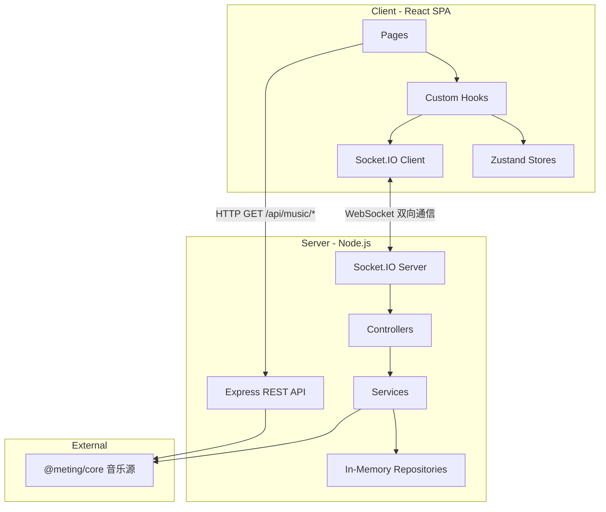

# 架构与数据流

## 整体架构



## Socket 事件清单

| 分类         | 客户端 → 服务端                                                                                                                     | 服务端 → 客户端                                                                                                                            |
| ------------ | ----------------------------------------------------------------------------------------------------------------------------------- | ------------------------------------------------------------------------------------------------------------------------------------------ |
| **Room**     | `room:create`, `room:join`, `room:leave`, `room:list`, `room:settings`, `room:set_role`                                             | `room:created`, `room:state`, `room:user_joined`, `room:user_left`, `room:settings`, `room:error`, `room:list_update`, `room:role_changed` |
| **Player**   | `player:play`, `player:pause`, `player:seek`, `player:next`, `player:prev`, `player:sync`, `player:sync_request`, `player:set_mode` | `player:play`, `player:pause`, `player:resume`, `player:seek`, `player:sync_response`                                                      |
| **Queue**    | `queue:add`, `queue:add_batch`, `queue:remove`, `queue:reorder`, `queue:clear`                                                      | `queue:updated`                                                                                                                            |
| **Chat**     | `chat:message`                                                                                                                      | `chat:message`, `chat:history`                                                                                                             |
| **Vote**     | `vote:start`, `vote:cast`                                                                                                           | `vote:started`, `vote:result`                                                                                                              |
| **Auth**     | `auth:request_qr`, `auth:check_qr`, `auth:set_cookie`, `auth:logout`, `auth:get_status`                                             | `auth:qr_generated`, `auth:qr_status`, `auth:set_cookie_result`, `auth:status_update`, `auth:my_status`                                    |
| **Playlist** | `playlist:get_my`                                                                                                                   | `playlist:my_list`                                                                                                                         |
| **NTP**      | `ntp:ping`                                                                                                                          | `ntp:pong`                                                                                                                                 |

## 关键数据模型

```typescript
// 音乐曲目
interface Track {
  id: string
  title: string
  artist: string[]
  album: string
  duration: number
  cover: string
  source: 'netease' | 'tencent' | 'kugou'
  sourceId: string
  urlId: string
  lyricId?: string
  picId?: string
  streamUrl?: string
  requestedBy?: string // 点歌人昵称
  vip?: boolean // 是否为 VIP / 付费歌曲（可能无法播放或仅试听）
}

// 播放模式
type PlayMode = 'sequential' | 'loop-all' | 'loop-one' | 'shuffle'

// 音频质量档位 (kbps)
type AudioQuality = 128 | 192 | 320 | 999

// 客户端可见的房间状态
interface RoomState {
  id: string
  name: string
  hostId: string
  hasPassword: boolean
  audioQuality: AudioQuality
  users: User[]
  queue: Track[]
  currentTrack: Track | null
  playState: PlayState
  playMode: PlayMode
}

// 播放状态（含服务端时间戳用于同步校准）
interface PlayState {
  isPlaying: boolean
  currentTime: number
  serverTimestamp: number
}

// 预定执行播放状态（play/pause/seek/resume 广播时使用）
interface ScheduledPlayState extends PlayState {
  serverTimeToExecute: number // 客户端应在此服务器时间点执行动作
}

// 歌单元数据
interface Playlist {
  id: string
  name: string
  cover: string
  trackCount: number
  source: MusicSource
  creator?: string
  description?: string
}

// 用户（RBAC: owner > admin > member）
// hostId 是自动选举的播放主持(conductor)，不是可见角色
interface User {
  id: string
  nickname: string
  role: UserRole
}
type UserRole = 'owner' | 'admin' | 'member'

// 聊天消息
interface ChatMessage {
  id: string
  userId: string
  nickname: string
  content: string
  timestamp: number
  type: 'user' | 'system'
}
```

## 播放同步机制

采用**事件驱动同步 + 周期性比例漂移校正**架构：NTP 时钟同步 + Scheduled Execution + 比例控制漂移校正（EMA 平滑 + proportional rate + hard seek）。

**三层防护**：

1. **NTP 时钟同步**：保证各客户端时钟与服务器对齐（时间衰减加权中位数）
2. **Scheduled Execution**：离散事件（play/pause/seek/resume）通过预定执行消除网络延迟差异（P90 RTT 自适应调度）
3. **周期性比例漂移校正**：客户端每 2 秒发起 `PLAYER_SYNC_REQUEST`，服务端返回当前预期位置；漂移经 EMA 低通滤波后进入比例控制器，rate 调整幅度与漂移成正比（自然收敛无振荡），>200ms 用 hard seek 跳转

## Layer 1：NTP 时钟同步 + RTT 回报

客户端与服务器通过 `ntp:ping` / `ntp:pong` 事件交换时间戳，计算 `clockOffset`（客户端与服务端时钟差值），使 `getServerTime()` 返回与服务端对齐的时间。

- 初始阶段：快速采样（每 50ms）收集 20 个样本，使用 `switchedRef` 保证仅在首次校准完成时切换到稳定阶段
- 稳定阶段：每 5 秒一次 NTP 心跳
- NTP 仅在用户进入房间后启动（`ClockSyncRunner` 渲染在 `RoomPage` 中），大厅用户不运行时钟同步
- 使用**时间衰减加权中位数**计算 offset：每个样本按 `exp(-age / halfLife)` 衰减（halfLife=30s），兼具中位数的异常值鲁棒性和对网络环境突变的快速收敛能力
- **`performance.now()` 锚点**：`getServerTime()` 基于 `performance.now()`（单调递增）计算时间流逝，不受系统时钟突变影响（NTP 调整、手动改时间、休眠唤醒）。每次 `processPong` 刷新锚点：`anchorServerTime = Date.now() + medianOffset`、`anchorPerfNow = performance.now()`
- **RTT 回报**：每次 `ntp:ping` 附带 `lastRttMs`（客户端中位 RTT），服务端在 `NTP_PING` handler 中调用 `roomRepo.setSocketRTT()` 存储，用于自适应调度延迟计算
- 核心模块：`clockSync.ts`（采样引擎 + `getServerTime()` + `getMedianRTT()` + `computeWeightedMedian()`）、`useClockSync.ts`（React Hook，在 SocketProvider 中运行）

## Layer 2：Scheduled Execution（预定执行）

所有多客户端同步动作（play、pause、seek、resume）由服务端广播 `ScheduledPlayState`，包含 `serverTimeToExecute` 字段。客户端收到后通过 `setTimeout(execute, serverTimeToExecute - getServerTime())` 在同一时刻执行，消除网络延迟差异。

- 服务端根据房间 **P90 RTT** 动态计算调度延迟：`max(P90RTT * 1.5 + 100, 300ms)`，上限 3000ms。P90 避免单个慢连接拖累整个房间，房间人数 ≤3 时退化为取 max
- RTT 由客户端 NTP 测量后通过 `ntp:ping` 事件回报，服务端以指数移动平均（alpha=0.2）平滑存储在 `roomRepository` 的 per-socket RTT map
- 全部客户端（含操作发起者）统一收到广播并在预定时刻执行
- **serverTimestamp 对齐**：播放中的动作（play/resume/seek）将 `room.playState.serverTimestamp` 设为 `serverTimeToExecute` 而非 `Date.now()`，确保 `estimateCurrentTime()` 在下一次 Host 上报前也能准确估算位置
- Scheduled action（seek/pause/resume）执行时自动重置 `rate(1)`，避免残留非正常速率；执行后同步更新 `roomStore.playState`（仅 `PlayState` 三字段，不含 `serverTimeToExecute`），确保 recovery effect 读到最新状态
- **NTP 未校准保护**：`scheduleDelay()` 和 `usePlayer` 的 PLAYER_PLAY 调度在 NTP 未校准完成前退化为 0（立即执行），避免本地时钟偏差导致离谱的调度延迟
- **Action ID 竞态保护**：每个 scheduled action 分配单调递增 ID，`setTimeout(fn, 0)` 回调执行前检查 ID 是否匹配，防止快速连续事件导致 stale 回调执行

## Layer 3：周期性比例漂移校正（EMA + Proportional Rate + Hard Seek）

**仅 Member 客户端**每 `SYNC_REQUEST_INTERVAL_MS`（2s）向服务端发送 `PLAYER_SYNC_REQUEST`（Host 跳过，因为 Host 是权威播放源，不应被 server 估算值反向校正），服务端通过 `estimateCurrentTime()` 计算当前预期位置后回复 `PLAYER_SYNC_RESPONSE`。客户端利用 NTP 校准时钟补偿网络延迟，计算原始漂移量后经 **EMA 低通滤波**（alpha=0.3）得到 `smoothedDrift`，再进入比例控制器：

- **新曲 Grace Period**：新曲加载后 `DRIFT_GRACE_PERIOD_MS`（3s）内**仅跳过 rate 微调**（EMA 产生的比例速率校正），但**保留 hard seek**（大偏差 >200ms 仍会跳转修正）。此窗口内 `estimateCurrentTime()` 基于 `scheduleTime` 锚点，尚未被 Host 上报修正，rate 微调可能基于不准确的估算。等待至少一次 Host 上报后再启用全面校正
- **EMA 平滑**：`smoothed = alpha * rawDrift + (1 - alpha) * prevSmoothed`，消除测量噪声导致的正负跳动
- **EMA 冷启动种子**：pause/resume/新曲/hard seek 后 EMA 重置，首次 sync response 直接用 rawDrift 种子初始化（而非从 0 开始混合），避免恢复播放后 6-8 秒的 EMA 收敛滞后
- `|smoothedDrift|` > `DRIFT_SEEK_THRESHOLD_MS`（200ms）→ hard seek 到预期位置 + rate(1) + 重置 smoothedDrift
- `|smoothedDrift|` 5~200ms（死区之上） → **比例控制**：`rate = 1 - clamp(smoothedDrift * Kp, ±MAX_RATE_ADJUSTMENT)`（Kp=0.5，最大 ±2%）。漂移越大修正越强，接近目标时自然减速——数学上保证不振荡
- `|smoothedDrift|` < `DRIFT_DEAD_ZONE_MS`（5ms）→ 恢复正常速率 rate(1)（消除稳态微小抖动）
- UI 展示 smoothedDrift 而非 rawDrift，界面数值更稳定
- **插件干扰自动降级**：设置 rate 后通过 `setTimeout(50ms)` 验证是否生效（timer 存于 ref，每次新 sync response 前清理上一个，组件卸载时也清理），若连续 3 次检测到被浏览器倍速插件覆盖才标记 `rateDisabled`；禁用后 hard seek 阈值降至 `DRIFT_PLUGIN_SEEK_THRESHOLD_MS`（30ms）；新曲加载时重置标记和计数器

典型场景：手机息屏暂停后解锁、浏览器后台标签页节流、网络波动导致的累积偏移。

## Host 上报与服务端状态维护

Host（房主）**自适应频率**上报当前播放位置到服务端：新曲开始后前 10 秒高频上报（每 2 秒，`HOST_REPORT_FAST_INTERVAL_MS`），之后回到正常频率（每 5 秒，`HOST_REPORT_INTERVAL_MS`），使用动态 `setTimeout` 链实现。仅用于维护 `room.playState` 的准确性（供 mid-song join、reconnect recovery 和漂移校正使用），**不会转发给其他客户端**。Host 标签页从后台恢复时（`visibilitychange` → visible），立即补偿上报一次当前位置，避免 `setTimeout` 被浏览器节流后 `playState` 过时。

- **NTP 校准时间戳**：Host 上报时附带 `hostServerTime`（通过 `getServerTime()` 获取的 NTP 校准后服务器时间），服务端优先使用此值作为 `playState.serverTimestamp`，替代 `Date.now()`。这消除了 Host→Server 单向网络延迟（≈RTT/2）导致的 `estimateCurrentTime()` 系统性落后偏差。服务端对 `hostServerTime` 做 10 秒容差校验（`Math.abs(hostServerTime - Date.now()) < 10_000`），超出范围回退到 `Date.now()`
- 服务端通过 `playerService.validateHostReport()` 校验 Host 上报位置与 `estimateCurrentTime()` 预估值的偏差，超过 `HOST_REJECT_DRIFT_THRESHOLD_S`（3 秒）的报告视为过时数据（如手机息屏后恢复）被拒绝；但连续拒绝 `HOST_REJECT_FORCE_ACCEPT_COUNT`（2）次后强制接受以打破僵局。`hostRejectCount`、`lastNextTimestamp`、`playMutexes` 统一在 `playerService.cleanupRoom()` 中清理，避免内存泄漏。Host 切换时自动刷新 `playState.serverTimestamp` 和 `currentTime`，确保新 Host 的首个报告不会被误拒
- `syncService.estimateCurrentTime()` 基于 Host 上报的位置 + 经过时间估算当前位置，对 `elapsed` 做 `Math.max(0, ...)` 防护（`serverTimestamp` 可能是未来的 `scheduleTime`），且 clamp 到曲目时长上界（`room.currentTrack.duration`），防止 Host 断线后估算值无限增长
- 新用户加入时，通过 `ROOM_STATE` 获取 `playState` 并计算应跳转到的位置
- 断线重连时，`usePlayer` 的 recovery 机制自动检测 desync 并重新加载音轨。Recovery 通过检查 `loadingRef` 避免与 `onPlayerPlay` 双重 `loadTrack`，且在加载前清理 `playTimerRef` 防止定时器重复触发
- **加载补偿上限**：`useHowl` 加载音频后会根据 `loadStartTime` 计算 elapsed 补偿 seek，但 elapsed 被 `MAX_LOAD_COMPENSATION_S`（2s）上限 clamp，防止网络慢时跳过歌曲开头过多
- 漂移校正时，`PLAYER_SYNC_RESPONSE` 基于此数据返回准确位置

## 播放模式

房间支持 4 种播放模式（`PlayMode`），由 `room.playMode` 字段控制，默认 `loop-all`：

| 模式         | 说明                                   |
| ------------ | -------------------------------------- |
| `sequential` | 顺序播放，末尾停止                     |
| `loop-all`   | 列表循环，末尾回到第一首               |
| `loop-one`   | 单曲循环，重播当前曲目                 |
| `shuffle`    | 随机播放，从队列随机选一首（排除当前） |

- **Host/Admin** 直接 emit `player:set_mode`，服务端更新 `room.playMode` 并广播 `ROOM_STATE`
- **Member** 通过 `vote:start { action: 'set-mode', payload: { mode } }` 投票切换
- **指定播放**：播放列表工具栏提供 Play 按钮，Host/Admin 直接 emit `player:play`；Member 通过 `vote:start { action: 'play-track', payload: { trackId, trackTitle } }` 投票播放
- **投票移除**：播放列表工具栏的删除按钮对所有用户可见，Host/Admin 直接 emit `queue:remove`；Member 通过 `vote:start { action: 'remove-track', payload: { trackId, trackTitle } }` 投票移除
- 服务端 `queueService.getNextTrack(roomId, playMode)` 根据模式返回下一首；`getPreviousTrack` 在 `loop-all` 模式下支持尾→首回绕
- 客户端 `PlayerControls` 提供循环切换按钮，带 `AnimatePresence` 图标过渡动画

## 音频质量

房间支持 4 档音质（`AudioQuality`），由 `room.audioQuality` 字段控制，默认 `320`（HQ）：

| 档位    | bitrate  | 说明                        |
| ------- | -------- | --------------------------- |
| 标准    | 128 kbps | 流量节省                    |
| 较高    | 192 kbps | 平衡音质与流量              |
| HQ      | 320 kbps | 高品质（默认）              |
| 无损 SQ | 999 kbps | 无损音质，通常需要 VIP 账号 |

- **仅房主**可在房间设置中切换音质
- 音质切换仅对**下一首歌**生效，当前播放不中断
- 服务端 `playerService.playTrackInRoom()` 从 `room.audioQuality` 读取 bitrate，通过 `resolveStreamUrl()` 请求流 URL
- **降级策略**：如果请求的 bitrate 获取不到（VIP 限制或平台不支持），自动逐级降低 bitrate 重试（999 → 320 → 192 → 128）
- 三个平台（netease / tencent / kugou）统一使用同一 bitrate 参数，Meting 内部处理各平台差异
- `musicProvider.streamUrlCache` 的 key 包含 bitrate，不同音质自动隔离缓存

## 队列清空

- Host/Admin 可通过播放列表抽屉的「清空」按钮（`ListX` 图标）一次性清空队列
- 采用二次确认防误操作：首次点击变为 destructive 提示，3 秒内再次点击才执行
- 服务端 `queue:clear` handler 复用 `remove` on `Queue` 权限，清空后停止播放并广播 `QUEUE_UPDATED` + `PLAYER_PAUSE` + `ROOM_STATE`

## 其他同步机制

1. **暂停快照**：服务端 `pauseTrack()` 在暂停前调用 `estimateCurrentTime()` 快照准确位置
2. **恢复播放**：暂停后点击播放，服务端检测同一首歌时发 `player:resume`（所有客户端预定时刻恢复）
3. **自动续播**：房主独自重新加入时，若有歌曲暂停/排队中，自动恢复播放
4. **加入房间补偿**：中途加入的客户端使用 `getServerTime()` 计算当前应处的播放位置，采用 fade-in 淡入策略（400ms 等待 + 200ms fade）减少加入延迟
5. **房间宽限期**：房间空置 60 秒 (`ROOM_GRACE_PERIOD_MS`) 后自动清理（重复调用 `scheduleDeletion` 不会创建重复 timer）
6. **角色与 Conductor 机制**：房间记录 `creatorId`（创建者 ID，永久不变）和 `adminUserIds: Set<string>`（持久化 admin 集合）。`user.role` 仅表示权限（`owner` / `admin` / `member`），`room.hostId` 是自动选举的播放主持（conductor）。Conductor 在用户加入/离开时自动重选（优先级：owner > admin > member），无需宽限期。创建者始终为 `owner`，返回时自动成为 conductor。`setUserRole` 只能设置 `admin` / `member`（不能改 `owner`），同步维护 `adminUserIds`。返回的创建者/持久化 admin 免密码验证
7. **持久化用户身份**：客户端通过 `storage.getUserId()` 生成并持久化 `nanoid`，每次 `ROOM_CREATE` / `ROOM_JOIN` 携带 `userId`，使服务端可跨 socket 重连识别同一用户。服务端通过 `roomRepo.getSocketMapping(socket.id)` 获取 `{ roomId, userId }` 映射——`socket.id` 仅用于 Socket 映射查找，所有涉及用户身份的操作（host 判断、auth cookie 归属、权限检查等）统一使用 `mapping.userId`
8. **`currentUser` 自动推导**：`roomStore` 中 `currentUser` 始终从 `room.users` 自动推导（`deriveCurrentUser`），`setRoom` / `addUser` / `removeUser` / `updateRoom` 等 action 内部自动同步，不暴露 `setCurrentUser` 以避免脱节风险
9. **断线时钟重置**：`resetAllRoomState()` 除重置 Zustand stores 外，还调用 `resetClockSync()` 清空 NTP 采样，确保重连后使用全新的时钟校准数据
10. **Socket 断开竞态防护**：页面刷新时新旧 socket 的 join/disconnect 到达顺序不确定，`leaveRoom` 通过 `roomRepo.hasOtherSocketForUser()` 检测同一用户是否有更新的 socket 连接，避免旧 socket disconnect 误删活跃用户
11. **投票安全网**：`voteController` 接收 `VOTE_START` 时，若检测到用户已有直接操作权限（owner/admin），不再返回错误，而是直接执行该操作（`executeAction`），防止客户端-服务端角色不同步时操作失效。部分 VoteAction 通过 `PERM_MAP` 映射到不同的 CASL action+subject（如 `'play-track'` → `('play', 'Player')`，`'remove-track'` → `('remove', 'Queue')`）
12. **切歌防抖**：500ms (`PLAYER_NEXT_DEBOUNCE_MS`) 内不重复触发下一首。`playNextTrackInRoom` / `playPrevTrackInRoom` 将 debounce 检查和队列导航封装在 per-room mutex 内部，确保同 tick 的多个 NEXT/PREV 事件不会都通过 debounce。支持 `{ skipDebounce: true }` 选项，投票执行、删除当前曲目等场景绕过 debounce 以确保操作不被静默吞掉
13. **停止播放统一处理**：`playerService.stopPlayback()` 统一处理"队列为空/清空"场景——清除 currentTrack、emit PLAYER_PAUSE、广播 ROOM_STATE、刷新大厅列表，避免 controller 中重复逻辑。`stopPlaybackSafe()` 提供 mutex 保护版本，`QUEUE_CLEAR` 使用此版本防止与并发 `autoPlayIfEmpty` 竞态
14. **大厅重连刷新**：`useLobby` 监听 socket `connect` 事件，断线重连后自动重新拉取房间列表
15. **投票执行**：`VOTE_CAST` / `VOTE_START` 中 `executeAction` 使用 `await` 确保动作完成后才广播 `VOTE_RESULT`。投票的 `next`/`prev` 通过 `playerService.playNextTrackInRoom` / `playPrevTrackInRoom`（`skipDebounce: true`）执行，与直接操作路径完全一致（含 stopPlayback 兜底和播放失败重试），且不受 debounce 影响
16. **密码安全隔离**：`toPublicRoomState()` 默认不含密码明文；`toPublicRoomStateForOwner()` 仅在发送给 owner 的 socket 时使用（创建房间、加入房间、设置变更、conductor 变更）。非 owner 成员仅能看到 `hasPassword` 布尔标记，无法获取密码明文。设置广播通过 `socket.emit`（owner） + `socket.to(roomId).emit`（其他成员）分别发送。owner 离开导致 conductor 变更时，通过 `roomRepo.getSocketIdForUser()` 反查新 owner 的 socketId 定向发送含密码版本

## REST API

| 路径                       | 方法 | 用途                                                                                                    |
| -------------------------- | ---- | ------------------------------------------------------------------------------------------------------- |
| `/api/music/search`        | GET  | 搜索曲目（`source` + `keyword` + `page`）                                                               |
| `/api/music/url`           | GET  | 解析流媒体 URL（`source` + `id`）                                                                       |
| `/api/music/lyric`         | GET  | 获取歌词                                                                                                |
| `/api/music/cover`         | GET  | 获取封面图                                                                                              |
| `/api/music/playlist`      | GET  | 获取歌单曲目列表（`source` + `id` + `limit` + `offset`），分页返回 `{ tracks, total, offset, hasMore }` |
| `/api/rooms/:roomId/check` | GET  | 房间预检（存在性 + 是否需要密码），用于分享链接直接访问时的前置校验                                     |
| `/api/health`              | GET  | 健康检查                                                                                                |

---
